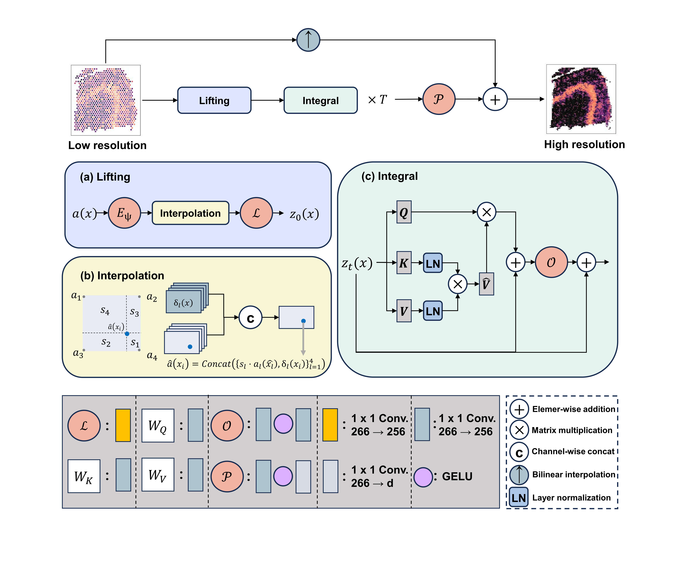

# NORMST
NORMST: a neural operator for resolution magnification in spatial transcriptomics

#### Overview



## Geometry-adaptive local-global models

The unified implementation supports standard Visium masked-spot recovery,
frozen-AE composition recovery, and official paired Visium HD 16-to-8
micrometre prediction. Standard Visium and AE-NORMST use compact visible point
tokens and the native six-neighbour topology; Visium HD uses the original
Cartesian bin grid. All routes combine a local operator, Galerkin global
operator and interpolation residual baseline.

### Standard Visium

Place each standard Visium slice in a direct child directory such as
`/data/yejiachen/Workdir/Data/visium/151673`. The training entry discovers
valid slices, randomly splits them 4:1:1 at slice level using `--seed`, and
saves the exact split to `output_dir/manifest.json`. A prebuilt split can be
supplied with `--manifest` instead of `--visium-root`.

```bash
python /data/yejiachen/Workdir/NORMST/train.py \
  --task visium \
  --visium-root /data/yejiachen/Workdir/Data/visium \
  --output-dir /data/yejiachen/Workdir/NORMST/save/multislice/seed2027 \
  --seed 2027
```

Every mask from a training slice is used for training; validation and test
slices never contribute masks to training. HVGs and default RMS scales are
fitted only on training slices. Positive `--target-sum` values apply
library-size normalization before `log1p`; use `--target-sum -1` or `0` for
`log1p(raw counts) + RMS`. Add `--no-rms-scale` only to skip RMS. Training
records pooled loss only; validation and test retain complete per-slice and
equal-slice macro metrics.

Use `--fixed-genes <genes.txt>` to reuse an exact non-empty, unique gene order;
the file length must equal `--n-genes`. CP10K/log1p and RMS are still fitted
from the assigned training slices. The saved config records the resolved source
and normalized gene SHA-256. A frozen-GeneAffine F1 run and its calibration-only
C1 source must use the same fixed genes, manifest, seed, and matched settings.

Test prediction arrays are not saved after training by default. Add
`--save-predictions` to export them immediately. A downloaded run can recreate
the same test predictions later by loading its saved model and preprocessing
contract; the supplied manifest must point to locally accessible slice paths:

```bash
python train.py --task visium \
  --output-dir save/multislice/seed2027 \
  --manifest /local/path/manifest.json \
  --predict-only
```

`--predict-only` loads `best.pt` by default; use `--checkpoint` to select a
different checkpoint.

Standard-Visium ablations can use
`--residual-head-width-multiplier {1,2}` to select the residual MLP hidden
width. `--baseline-calibration --calibration-only` constructs an
IDW-plus-GeneAffine control in which only the identity-initialized gene-wise
scale and bias are trained and the residual correction is fixed to zero.
`--input-coordinate-lifting` optionally injects normalized within-slice
coordinates into the initial tokens; it is disabled by default.

### AE-NORMST

AE-NORMST is an additive task and does not change either existing model. It
loads a completed count-aware AE, freezes all AE weights, and predicts only its
standardized composition latent. The hidden spot's library size never enters
the forward pass, IDW baseline, or loss. The frozen decoder is used only for a
composition auxiliary loss and evaluation; its parameters remain frozen while
gradients can pass back to the NORMST latent prediction.

```bash
python train.py --task ae_visium \
  --manifest pre-train/manifests/random_pair_8_2_2_seed2027.json \
  --ae-checkpoint /path/to/frozen-ae/best.pt \
  --output-dir save/ae_normst/composition_only_seed2027 \
  --library-context zero \
  --seed 2027
```

For the matched visible-library condition, change only
`--library-context zero` to `--library-context visible`. Both modes instantiate
the same library-lifting layer and therefore have identical model shapes and
parameter counts. The visible condition supplies train-standardized
`log1p(full-gene total UMI)` for visible spots only. Training writes latent and
decoded-composition metrics per slice and as equal-slice macro averages, along
with a latent-IDW baseline. Use `--predict-only` on a completed run to export
compact 32-dimensional test predictions.

### Paired Visium HD

```bash
python /data/yejiachen/Workdir/NORMST/train.py \
  --task visium_hd \
  --lr-dir /home2/yejiachen/ST/HBCHD/binned_outputs/square_016um \
  --hr-dir /home2/yejiachen/ST/HBCHD/binned_outputs/square_008um \
  --output-dir /data/yejiachen/Workdir/NORMST/save/HBCHD/geometry_adaptive_seed2027 \
  --seed 2027
```

### Synthetic validation

```bash
python -m unittest discover -s tests
```
